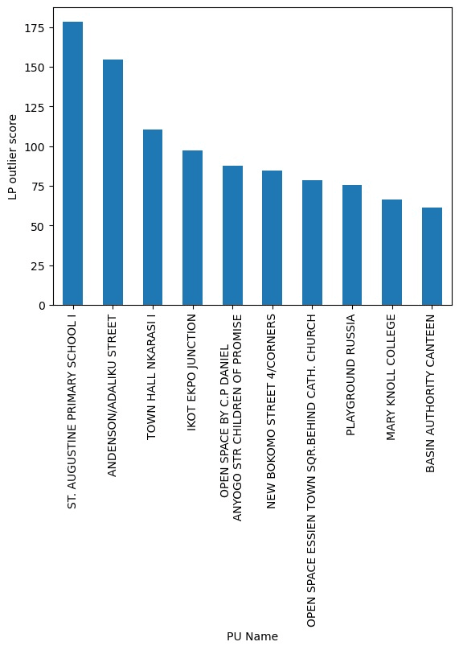

## Introduction
This report presents a geospatial analysis and outlier detection of polling unit results in Cross River State.

## Methodology
The methodology involves computing geodesic distances between polling units and identifying those with vote counts significantly different from their neighbors.
The analysis follows these steps:
1. Data Loading and Preparation: The data is loaded from a CSV file and cleaned by removing rows with missing latitude and longitude values.
2. Geodesic Distance Calculation: The geodesic distance matrix is computed using the latitude and longitude coordinates of the polling units. This matrix represents the distances between all pairs of polling units.  Geocoding technique
3. Outlier Detection: Neighbors within 500 meter radius are identified for each polling unit. 
4. Results Compilation: The outlier scores are compiled, and the top 3 outliers for each party are identified and visualized.
   
## Problem Statement
 The analysis focuses on identifying outliers in the vote counts for four major parties: APC, LP, PDP, and NNPP. 
 
## Data Overview/ Data Source
Data Set Link :https://drive.google.com/drive/folders/173oHgms6wYy5WKz_i3Lhl5mXcmobCWHz

The dataset contains the following columns:
- State
- LGA
- Latitude
- Longitude
- Ward
- PU-Code
- PU-Name
- Accredited_Voters
- Registered_Voters
- Total Votes
- Difference
- Invalid Unit Votes
- Results_Found
- Transcription_Count
- APC
- LP
- PDP
- NNPP
- Results_File

## Summary of Findings
The Cross River Dataset indicates there are 124 distinct Local Government Areas in Cross River State. 340,000 votes were cast, with 367,000 people accredited to vote, and 81,000 votes deemed invalid. Voting took place in 238 distinct wards across 2,642 polling units throughout the state. Outlier scores for each polling unit were calculated for the four major parties: APC, PDP, LP, and NNPP. The results are summarized in the following visuals highlighting the top three outliers for each party showing the over-voting of those political parties in the polling units.
## Data Visualization

# APC Outliers
 The above polling units show a significant deviation in APC vote counts compared to its neighboring units within a 500-meter radius. The high outlier score suggests potential anomalies or distinct voting patterns at this location
 
 
 ## LP Outliers
 "YACHE” The LP vote count at this ward is significantly higher than its neighbors, indicating an outlier. This could point to specific local influences or irregularities.
 
 ## PDP OUtliers
 
 
 ## NNPP Outliers
 
 
 This aforementioned polling unit stands out with a high NNPP outlier score, suggesting a unique voting behavior.

##   Insights
●	Several polling units exhibited vote counts that significantly deviated from their neighbors, indicating potential anomalies or unique local factors.

●	 Each party had distinct outliers, suggesting varied voting behaviors or potential irregularities in different regions.

## Conclusion
The geospatial analysis and outlier detection identified significant deviations in vote counts for the four major parties across various polling units. The top outliers were highlighted and visualized to illustrate the anomalies. This report provides a detailed overview of the methodology, findings, and insights derived from the geospatial analysis and outlier detection.

