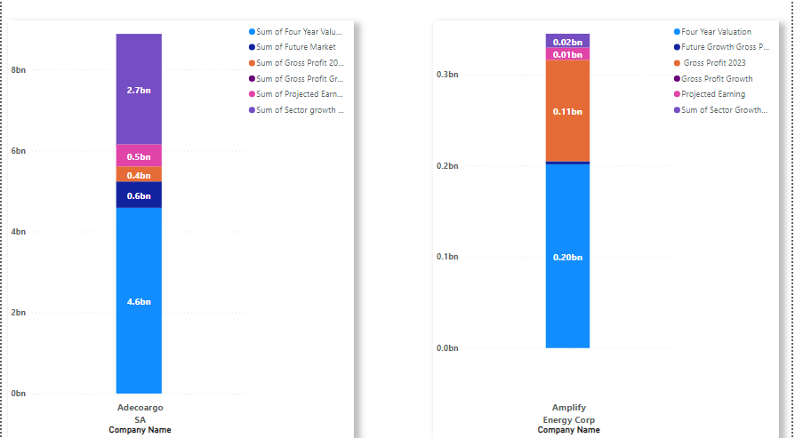
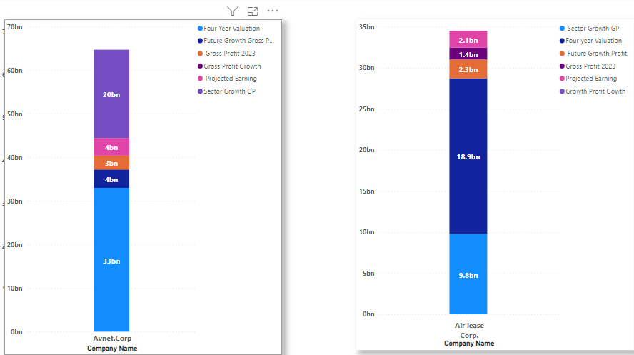

## FORCATING FINANCIAL VALUE

## INTRODUCTION
This report presents an analysis of undervalued companies using financial data, focusing on gross profit and gross profit growth compared to peers within the same sector. The study aims to project the true value of these companies in four years. The chosen companies are Adecargo SA, Air Lease Corp, Amplify Energy Corp, and Avent Corp from the Consumer defensive sector and industrial, Energy, and Technology Sectors respectively.
## METHODOLOGY
 ## Data Collection:
•	Data was sourced from : https://finviz.com/ focusing on gross profit (GP) and gross profit growth (GPG) 
•	Gross profit growth was calculated using Excel functions.
•	Similar data was collected for peer companies in the same sector.
 ## Comparative Analysis:
•	The selected company's gross profit and gross profit growth were compared to their peers.
•	Current valuation metrics such as P/E ratio, PEG, and P/B ratio were also analyzed.
 ## Valuation Model:
•	A model projecting the company’s value in four years was created using current GP, GPG, and sector trends using Excel Functions.
•	An additional variable, was factored into the valuation to assess its impact on the company's future value.
 ## Data Processing in Power BI:
•	The data was imported into Power BI.
•	Visualizations and charts were developed to illustrate the projected growth and valuation.

## INSIGHTS
 ## link to Spreadsheet : https://docs.google.com/spreadsheets/d/1_mSMf6aB-spSRj0r26a6pliye20Mj2NnQqxG9zIgVwU/edit?usp=sharing

 ## Projected Future Values
Avnet Corp. is projected to experience substantial growth, with gross profit expected to rise from $3,182.14M to $4,219.58M, driven by a consistent growth rate of 7.31%, likely fueled by technological advancement.

Air Lease Corp. is forecasted to grow rapidly, with gross profit projected to soar from $1,442.01M to $18,937.11M, positioning it as one of the fastest-growing companies in its sector.

Amplify Energy Corp. is also anticipated to see significant growth, with gross profit expected to increase from $111.25M to $201.59M.

Adecoagro Corp. stands out with a gross profit growth rate of 16%, leading to an impressive increase of $2,727,652,203.15. Its lower P/E and P/B ratios suggest it may be undervalued relative to its peers

## CONCLUSION
The results indicate that all four identified companies are currently undervalued. Their competitive gross profit growth rates and lower valuation metrics (P/E and P/B ratios) compared to sector averages suggest significant potential for appreciation. The projected market caps, both with and without factoring circumstances, further support this conclusion.

Adecoagro Corp., with its robust gross profit growth rate of 16% and a significant increase in gross profit by $2,727,652,203.15, demonstrates the substantial potential for value appreciation. Its lower valuation ratios indicate it is currently undervalued relative to its peers. The company’s strategic positioning and operational efficiencies in the Consumer Defensive sector likely drives  its forecasted growth.

Avnet Corp. is projected to see substantial growth, with gross profit expected to rise from $3,182.14M to $4,219.58M, driven by a consistent growth rate of 7.31%. Technological advancements will likely to enhance its profitability and market position, reinforcing its potential undervaluation. Avnet Corp.’s strategic focus on innovation and technological integration positions it well for future growth in the Technology sector.

Air Lease Corp. stands out as one of the fastest-growing companies in its sector, with gross profit projected to soar from $1,442.01M to $18,937.11M. This rapid growth underscores its strong market potential and suggests that the company is currently undervalued. The company’s strategic fleet expansion and favorable market conditions in the industrial sector are key factors driving its impressive growth trajectory.

Amplify Energy Corp. is also expected to see significant growth, with gross profit projected to increase from $111.25M to $201.59M. This growth reflects its potential to capitalize on market opportunities and enhance its financial performance. Amplify Energy Corp.’s focus on efficient resource management and strategic asset acquisition positions it for substantial growth in the Energy sector.

In summary, these companies exhibit strong growth prospects and lower valuation metrics, indicating that they are undervalued and present attractive investment opportunities. The potential for substantial returns in the coming years is supported by their strategic initiatives, sector-specific drivers, and market conditions, highlighting their promising future performance.

