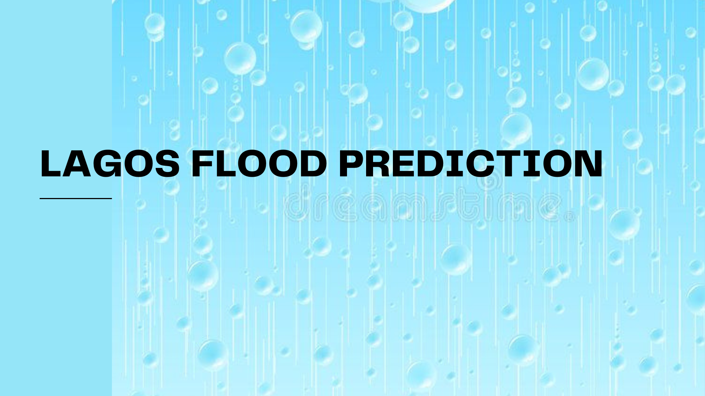
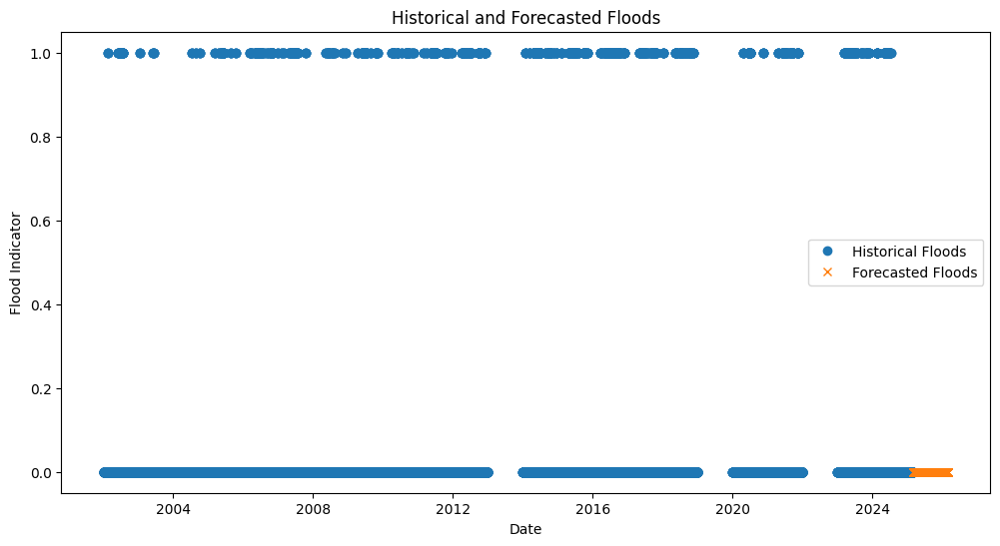
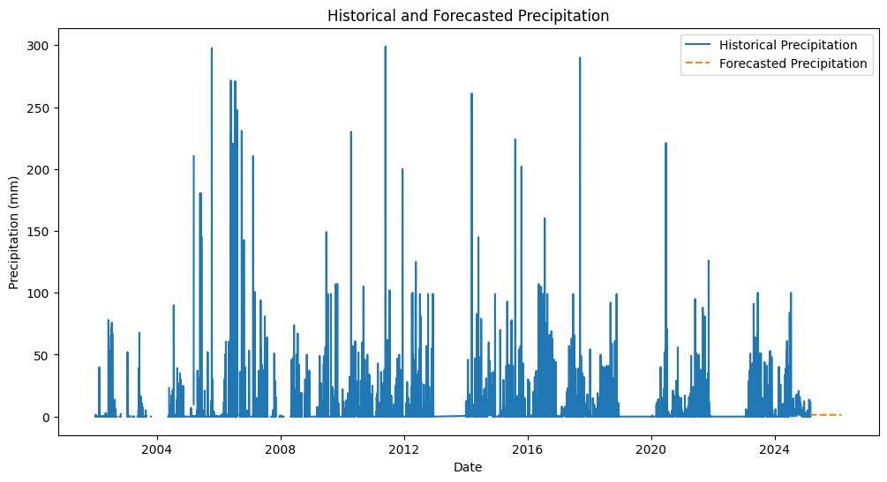

## LAGOS STATE FLOOD PREDICTION ANALYSIS 
## INTRODUCTION

## Objective

The report uses historical weather data to predict the likely date of the next flood in Lagos. By analyzing past weather patterns and using predictive modeling, we aim to identify periods of high flood risk.

## DATA SOURCE
The dataset used for this analysis is combined_weather_data.csv, which contains weather data from January 1, 2004, to December 31, 2024. The dataset includes parameters such as temperature, humidity, wind speed, and precipitation. https://drive.google.com/file/d/1tHGCRXagd3xOlANdCdn_FdtYP51kq2Kl/view

## DATA PREPARATION
1.	The dataset was loaded into a pandas Data Frame.
2.	The date time column was converted to the datetime type.
3.	Rows with missing dates were removed, and duplicate rows were dropped.
4.	The date time column was set as the index, ensuring it was monotonic and had a daily frequency.
   
## METHODOLOGY
An ARIMA model was used to forecast future precipitation, which is a critical factor in predicting floods. The steps involved:
1.	Aggregating Monthly Precipitation: Summing daily precipitation to get monthly values.
2.	 Fitting the ARIMA model to historical monthly precipitation data.
3.	Forecasting: Predicting future monthly precipitation values to identify periods of high flood risk.
   
## CODE
see files: (LagosFlood_Prediction CODE)

## INSIGHTS
Precipitation: Historical data shows periods of high and low precipitation. Significant peaks are potential indicators of past flood events.
•	Temperature, Humidity, and Wind Speed: These factors were analyzed but did not show strong direct correlations with floods compared to precipitation.
Predicted Precipitation
The ARIMA model forecasted monthly precipitation for the next 12 months. The forecast shows periods of higher precipitation, which may indicate potential flood risk.

## VISUALIZATION

## ANALYSIS
The forecasted flood predictions show a potential decrease in flood risk compared to historical events.

## CONCLUSION
Based on my analysis no flood days are predicted within the forecast period using the defined threshold.

