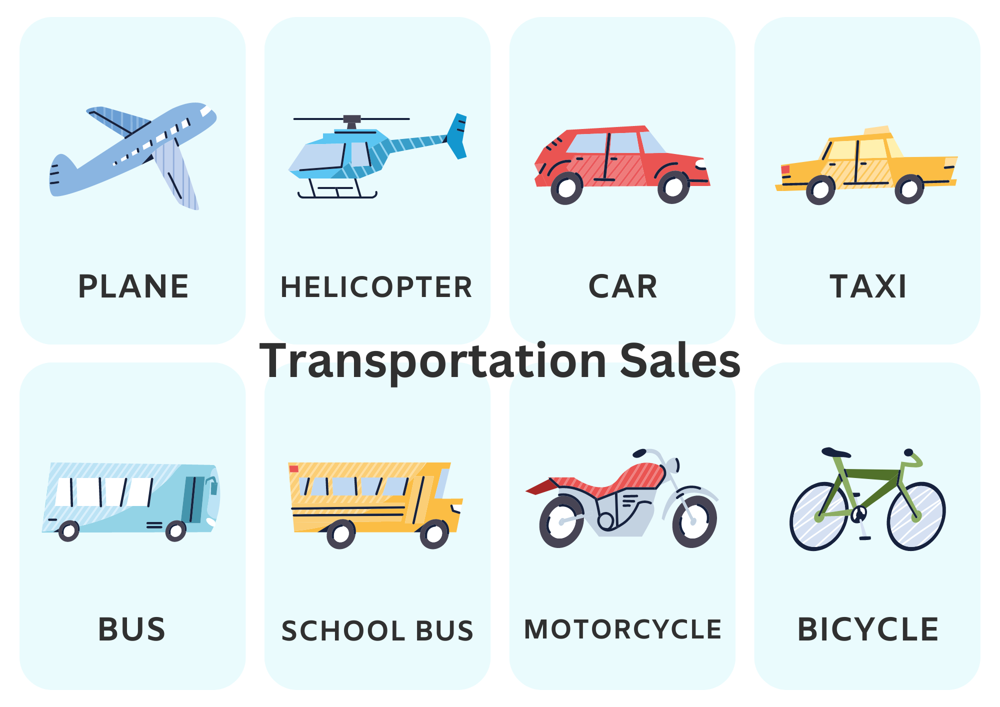

# Sales_Data_Set_Analysis

## Introduction
This sales dataset features 7 distinct product lines, including classic cars, vintage cars, planes, ships, motorcycles, trains, and trucks and buses, spanning 19 different countries and companies. The dataset comprises 25 columns and 2,824 rows.
OBSERVATION:It includes dependent variable details such as customer data and product information, like customer name, city, product line, order date, quantity, and price, represented in numerical, string, and date data types. However, two columns—Address Line and State—contain the most null values, and several columns, such as address, phone number, and postal codes, exhibit inconsistent data.

## Data Source
Link to the data set: https://www.kaggle.com/datasets/kyanyoga/sample-sales-data Retail Dataset in Kaggle

## Problem Statement
This involves a preliminary review of a sales dataset. The goal of this task is to identify insights at first glance, without diving into deep analysis. This exercise will help us understand the data better and prepare for more detailed examinations in the future.

## Skills Demonstrated
The following Power BI features were incorporated:
- Power Query,
- Quick Measure,
- Filters,
- Slicers,
- Visuals

 ## Data Preparation
 I started by downloading the data from the provided link and conducted an initial review to identify preliminary insights without deep analysis. However, a thorough understanding of the dataset was crucial. I then refined the data and created visualizations to effectively tell the story.

## Visualization
To enhance storytelling with my visuals, I utilized bar charts, treemaps, pie charts, and cards in a dashboard. The dashboard is shown below.

A total of $10.03 million in sales was generated from this retail operation. These sales came from 92 distinct customers, each making purchases on various occasions.
The highest sales were from the United States, contributing about 36.16% of the total, followed by Spain at 12.12%, France at 11.07%, and Australia at 6.29%, among 19 countries.
Of the products sold, 92.1% were successfully shipped, though a small percentage encountered shipping issues, including cancellations, on-hold orders, resolutions, items in the process, and disputes. Despite these challenges, the business consistently excels in delivering its products.
Additionally, among the 7 product lines, classic cars achieved the highest sales.

## Conclusion/Recommendation
In conclusion, the retail sales dataset reveals key insights into business performance, generating $10.03 million in sales from 92 unique customers across 19 countries. The United States leads with 36.16% of total sales, followed by Spain, France, and Australia. Despite minor shipping issues, the high successful delivery rate highlights strong operational efficiency. Classic cars emerge as the top-selling product line. 
Further insights can be drawn by analyzing the Year ID to identify sales trends and seasonality, as well as growth patterns. Examining the order date can reveal the time taken for items to be shipped. Additionally, we can identify the least-selling products and calculate the average transaction value per customer.
